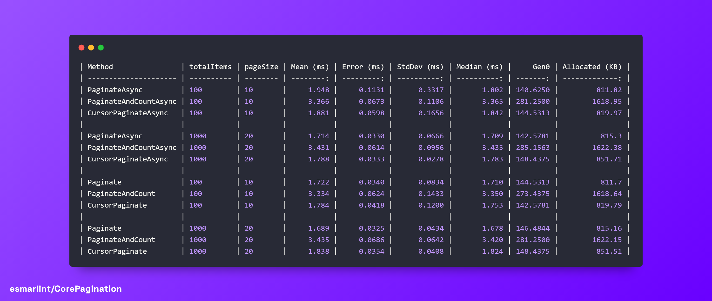

<p align="center">
  <a href="#" target="_blank">
    
  </a>
  <a href="#" target="_blank">
    
  </a>
  <a href="https://badgen.net/badge/completed%20tests/67/green" target="_blank">
    
  </a>
</p>

# CorePagination

CorePagination is a **lightweight and easy-to-use** pagination library designed specifically for **Entity Framework Core (EF Core)**. It offers a **straightforward and extensible** way to add pagination functionality to your **.NET projects**, improving efficiency and management of large datasets. 📊💪

With CorePagination, developers can avoid the complexity of creating custom pagination logic from scratch, benefiting from **pre-built and optimized methods**. The library's support for transformers, like `UrlResultTransformer`, provides out-of-the-box solutions for common pagination challenges. 🚀🔗

**Current Status:**

- ✅ Stable version available on NuGet (in progress)
- 🚧 Documentation in progress
- 🌐 Examples and tutorials under development
- 🔧 Continuous improvements based on community feedback

Simplify your pagination implementation with CorePagination today! 🎉

## Table of Contents

- [Introduction](#introduction)
- [Features](#features)
- [Installation Guide](#installation-guide)
- [CorePagination Usage Examples](#corepagination-usage-examples)
  - [Using `PaginateAsync`](#using-paginateasync)
  - [Using `PaginateAsync`](#using-PaginateAsync)
  - [Using `PaginateCursorAsync`](#using-PaginateCursorAsync)
- [Paginators](#paginators)
  - [Using Paginators](#using-paginators)
  - [SimplePaginator](#simplepaginator)
  - [SizeAwarePaginator](#sizeawarepaginator)
  - [CursorPaginator](#cursorpaginator)
  - [Creating Your Own Paginator](#creating-your-own-paginator)
- [Transformers](#transformers-in-corepagination)
  - [What are Transformers?](#what-are-transformers)
  - [Using Existing Transformers](#using-existing-transformers)
  - [Using Inline Transformations](#using-inline-transformations)
  - [Creating and Using Your Own Transformers](#creating-and-using-your-own-transformers)
  - [Example with Custom Transformer for Summary Data](#example-with-custom-transformer-for-summary-data)
- [URL Transformation Extensions](#url-transformation-extensions)
  - [Overview](#overview)
  - [Using URL Transformations](#using-url-transformations)
  - [Available Extensions](#available-extensions)
  - [Customizing URL Transformations](#customizing-url-transformations)
- [Upcoming Changes](#upcoming-changes)
  - [Roadmap to Version 1.0](#roadmap-to-version-10)
- [Contributing](#contributing)
- [License](#license)

## Features

- **Easy to Integrate**: Seamlessly integrates with any EF Core project.
- **Semantic and Short Methods**: Makes the code understandable and easy to use.
- **Extensible**: Allows for customizations and extensions to fit specific needs.
- **Support for Pagination URLs**: Generates URLs for page navigation, ideal for REST APIs.
- **Asynchronous by Nature**: Designed for asynchronous operations, leveraging EF Core capabilities.

## Installation Guide

To get started with CorePagination, you can easily install it using NuGet package manager. This guide assumes you have a working .NET environment set up.

### Prerequisites

- .NET Core 3.1 SDK or later.
- An existing .NET project or the ability to create a new one.

### Installing via NuGet

1. **Package Manager Console**

   Open the Package Manager Console within your Visual Studio and run the following command:

   ```sh
   Install-Package CorePagination
   ```

   This command will add the CorePagination package to your project.

2. **.NET CLI**

   If you prefer using the command line or you are working outside of Visual Studio, you can use the .NET CLI to install the package. Run the following command in your terminal:

   ```sh
   dotnet add package CorePagination
   ```

3. **Visual Studio NuGet Manager**

   - In Visual Studio, right-click on your project in the Solution Explorer and select "Manage NuGet Packages".
   - Navigate to the "Browse" tab and search for "CorePagination".
   - Click on the CorePagination package, select the version you wish to install, and press "Install".

### Verifying Installation

After installation, you can verify that CorePagination is correctly added to your project by checking the project's dependencies. In Visual Studio, you should see CorePagination listed under the NuGet node in the Solution Explorer.

### Next Steps

Once CorePagination is installed, you can start using it in your project by including the relevant namespaces in your files. For example:

```csharp
using CorePagination.Extensions;
```

Refer to the usage examples in this documentation to begin implementing pagination in your application.

# CorePagination Usage Examples

Import the CorePagination.Extensions namespace to get started:

```csharp
using CorePagination.Extensions;
```

## Using `PaginateAsync`

`PaginateAsync` is a comprehensive pagination method that provides detailed pagination results, including total item and page counts. It is particularly useful for user interfaces that require detailed pagination controls.

### Example with `PaginateAsync`

Below is an example demonstrating how to use `PaginateAsync` to paginate a list of `Product` entities:

```csharp
var context = new ApplicationDbContext();
var products = context.Products;

int pageNumber = 1;
int pageSize = 10;

//paginationResult: SizeAwarePaginationResult<Product>
var paginationResult = await products.PaginateAsync(pageNumber, pageSize);

// paginationResult includes:
// Items: List of products on the current page.
// TotalItems: Total count of products.
// TotalPages: Total number of pages.
// Page: Current page number.
// PageSize: Number of items per page.
```

### Example with `PaginateAsync` and Search Filter

```csharp
var context = new ApplicationDbContext();
var searchTerm = "example";
var filteredProducts = context.Products.Where(p => p.Name.Contains(searchTerm));

int pageNumber = 1;
int pageSize = 10;

var paginationResult = await filteredProducts.PaginateAsync(pageNumber, pageSize);
```

### Using `PaginateAsync`

`PaginateAsync` provides a basic pagination mechanism without the total count of items or pages, typically offering faster performance than PaginateAsync by eliminating the need for total count calculations.

#### Example with `PaginateAsync`

```csharp
var context = new ApplicationDbContext();
var products = context.Products;

int pageNumber = 1;
int pageSize = 10;

//paginationResult: PaginationResult<Product>
var paginationResult = await products.PaginateAsync(pageNumber, pageSize);

// paginationResult includes:
// Items: Current page's list of products.
// Page: Current page number.
// PageSize: Number of items per page.
```

### Using `PaginateCursorAsync`

`PaginateCursorAsync` is ideal for efficient and stateful pagination, such as infinite scrolling.

#### Example with `PaginateCursorAsync`

```csharp
var context = new ApplicationDbContext();
var products = context.Products.OrderBy(p => p.Id);

int pageSize = 10;
int? currentCursorId = null;

var paginationResult = await products.PaginateCursorAsync(
    p => p.Id, pageSize, currentCursorId, PaginationOrder.Ascending);

// paginationResult includes:
// Items: List of products for the current segment.
// PageSize: Number of items per segment.
// Cursor: Current cursor position.
```

#### Example with `PaginateCursorAsync` and Date-Based Cursor

```csharp
var context = new ApplicationDbContext();
var currentCursor = DateTime.Now.AddDays(-7);
var products = context.Products.OrderByDescending(p => p.CreatedAt);

int pageSize = 20;

var paginationResult = await products.PaginateCursorAsync(
    p => p.CreatedAt, pageSize, currentCursor, PaginationOrder.Descending);
```

These examples aim to provide clear and concise guidance for using CorePagination effectively in your applications.

# Paginators

Paginators are the core components of the CorePagination library, designed to abstract the complexity of pagination logic, making it easy and efficient to paginate large datasets. They provide a robust and flexible framework for implementing various pagination strategies, tailored to different application requirements and optimization needs. While paginators represent the core machinery for pagination, extensions are provided to streamline their use in everyday coding, offering a simpler interface that abstracts away some of the underlying complexities.

## Using Paginators

To leverage paginators directly in your application, you first need to understand the available paginator types and how to apply them according to your specific data retrieval and presentation needs.

### SimplePaginator

The `SimplePaginator` provides basic pagination functionality, fetching a specified page of data without computing the total number of items or pages. This approach is particularly efficient when you do not need to display total counts in your UI.

#### Example with `SimplePaginator`

```csharp
var context = new ApplicationDbContext();
var productsQuery = context.Products.AsQueryable();
var simplePaginator = new SimplePaginator<Product>();

int pageNumber = 1;
int pageSize = 10;

var parameters = new PaginatorParameters { Page = pageNumber, PageSize = pageSize };
var simplePaginationResult = await simplePaginator.PaginateAsync(productsQuery, parameters);
```

This result provides a straightforward set of items for the specified page, alongside basic pagination metadata like page number and page size.

### SizeAwarePaginator

The `SizeAwarePaginator` extends the basic pagination functionality by also computing the total number of items and the total number of pages. This paginator is suitable for interfaces that require detailed pagination controls.

#### Example with `SizeAwarePaginator`

```csharp
var context = new ApplicationDbContext();
var productsQuery = context.Products.AsQueryable();
var sizeAwarePaginator = new SizeAwarePaginator<Product>();

int pageNumber = 1;
int pageSize = 10;

var parameters = new PaginatorParameters { Page = pageNumber, PageSize = pageSize };
var sizeAwarePaginationResult = await sizeAwarePaginator.PaginateAsync(productsQuery, parameters);
```

In this example, `sizeAwarePaginationResult` includes detailed pagination information, facilitating the creation of more informative and interactive UI pagination components.

### CursorPaginator

The `CursorPaginator` is ideal for scenarios where continuous data loading is required, such as infinite scrolling or cursor-based navigation. It paginates data based on a cursor, typically an identifier or a timestamp, allowing for efficient retrieval of subsequent data segments.

#### Example with `CursorPaginator`

```csharp
var context = new ApplicationDbContext();
var productsQuery = context.Products.OrderBy(p => p.Id).AsQueryable();
var cursorPaginator = new CursorPaginator<Product, int>(p => p.Id);

int pageSize = 10;
int? currentCursor = null;

var cursorPaginationResult = await cursorPaginator.PaginateAsync(productsQuery, new CursorPaginationParameters<int> { PageSize = pageSize, CurrentCursor = currentCursor });
```

Here, `cursorPaginationResult` provides not only the current page of items but also the cursor for accessing the next segment, optimizing data loading for user experiences that require seamless data fetching.

### Creating Your Own Paginator

To create your own paginator, you need to implement the `IPagination<T, TParameters, TResult>` interface. This custom paginator can then be tailored to specific requirements, such as a unique pagination strategy or data source.

#### Example: Creating a Custom Paginator

```csharp
public class MyCustomPaginator<T> : IPagination<T, MyCustomPaginatorParameters, MyCustomPaginationResult<T>>
{
    public async Task<MyCustomPaginationResult<T>> PaginateAsync(IQueryable<T> query, MyCustomPaginatorParameters parameters)
    {
        // Implement your custom pagination logic here
        var items = await query.Skip(parameters.Page * parameters.PageSize).Take(parameters.PageSize).ToListAsync();

        return new MyCustomPaginationResult<T>
        {
            Items = items,
            Page = parameters.Page,
            PageSize = parameters.PageSize,
            // Add additional pagination-related information if needed
        };
    }
}
```

In this example, `MyCustomPaginator` provides a template for implementing pagination logic that fits your specific needs, offering flexibility beyond the built-in paginators.

### Transformers in CorePagination

#### What are transformers

Transformers in CorePagination are designed to modify or enhance the pagination results, allowing for additional data manipulation or formatting tailored to specific requirements. They provide a powerful way to adapt the paginated results into different formats or structures, facilitating their integration into various application contexts.

### Using Existing Transformers

CorePagination includes a set of predefined transformers that can be applied to your pagination results for common use cases. For instance, the `UrlResultTransformer` can be used to enrich pagination results with navigational URLs, which is particularly useful for web APIs.

#### Example: Applying `UrlResultTransformer`

```csharp
var context = new ApplicationDbContext();
var products = context.Products;
string baseUrl = "http://example.com/products";

var paginationResult = await products.PaginateAsync(pageNumber, pageSize);
var urlPaginationResult = paginationResult.Transform(new UrlResultTransformer<Product>(baseUrl));
```

In this example, `UrlResultTransformer` is used to append navigation URLs to the pagination result, enhancing its integration capabilities for client-side applications or APIs.

### Using Inline Transformations

Inline transformations allow you to apply custom transformations directly within your code, offering a quick and flexible way to adjust the output of pagination results.

#### Example: Inline Transformation

```csharp
var paginationResult = await products.PaginateAsync(pageNumber, pageSize);
var customResult = paginationResult.Transform(result => new {
    SimpleItems = result.Items.Select(item => new { item.Id, item.Name }),
    result.Page,
    result.PageSize,
    result.TotalItems
});
```

This inline transformation simplifies the paginated result, selecting only the `Id` and `Name` from each item, which might be particularly useful for reducing payload sizes in API responses.

### Creating and Using Your Own Transformers

You can extend CorePagination by creating your own transformers, implementing the `IPaginationTransformer<T, TResult>` interface to define custom logic for transforming pagination results.

#### Example: Creating a Custom Transformer

```csharp
public class MyCustomTransformer : IPaginationTransformer<Product, MyCustomProductResult>
{
    public MyCustomProductResult Transform(IPaginationResult<Product> paginationResult)
    {
        // Custom transformation logic
        return new MyCustomProductResult {
            CustomItems = paginationResult.Items.Select(item => new CustomItem { ... }),
            paginationResult.TotalItems
        };
    }
}
```

```csharp
var paginationResult = await products.PaginateAsync(pageNumber, pageSize);
var myCustomResult = paginationResult.Transform(new MyCustomTransformer());
```

This section demonstrates how to create a `MyCustomTransformer` that applies specific transformation logic to the pagination results, illustrating the extensibility of CorePagination for various application needs.

### Example with Custom Transformer for Summary Data

```csharp
public class ProductSummaryTransformer : IPaginationTransformer<Product, ProductSummaryResult>
{
    public ProductSummaryResult Transform(IPaginationResult<Product> paginationResult)
    {
        return new ProductSummaryResult
        {
            Items = paginationResult.Items.Select(p => new ProductSummary
            {
                Id = p.Id,
                Name = p.Name,
                Price = p.Price
            }),
            TotalItems = paginationResult.TotalItems
            // Other relevant summary fields
        };
    }
}

var context = new ApplicationDbContext();
var products = context.Products;

int pageNumber = 1;
int pageSize = 10;

var paginationResult = await products.PaginateAsync(pageNumber, pageSize);
var summaryResult = paginationResult.Transform(new ProductSummaryTransformer());
```

## URL Transformation Extensions

### Overview

CorePagination provides URL transformation extensions that allow you to easily enhance your pagination results with navigational links. These extensions are particularly useful when building web APIs, as they enable clients to navigate through paginated data effortlessly.

The URL transformation extensions in CorePagination offer the following benefits:

- **Improved User Experience**: By including navigational links in the pagination results, clients can easily navigate to the next, previous, first, or last page of data, enhancing the overall user experience.

- **Simplified Client-Side Logic**: With the navigational links readily available in the pagination results, clients no longer need to construct the URLs for pagination navigation themselves, simplifying the client-side logic.

- **Flexibility and Customization**: CorePagination provides different types of URL transformers that cater to various pagination scenarios. You can choose the transformer that best fits your needs and customize the generated URLs to match your API's structure.

### Using URL Transformations

To apply URL transformations to your pagination results, you can use the extension methods provided by CorePagination. Here's an example of how to use the `WithUrl` extension method directly on the pagination result:

```csharp
var urlPaginationResult = await products.PaginateAsync(pageNumber, pageSize)
                                         .WithUrl("/products")
```

In this example, the `WithUrl` extension method is called directly on the result of `PaginateAsync`, passing in the base path for the generated links. The extension method returns a new `UrlPaginationResult<T>` object that includes the navigational URLs. Additional configuration options, such as including total items, total pages, page size, and renaming parameters, are chained using the fluent API.

### Available Extensions

CorePagination provides the following URL transformation extensions:

- `WithSimpleUrl`: Generates basic navigational links, including URLs for the next and previous pages.
- `WithUrl`: Generates comprehensive navigational links, including URLs for the first, last, next, and previous pages, as well as the current page.
- `WithUrl` (for cursor-based pagination): Generates navigational links specific to cursor-based pagination, including the current URL and the URL for the next page.

### Customizing URL Transformations

CorePagination allows you to customize the generated URLs by configuring the URL transformers using the fluent API. Here are a few examples:

#### Example with relative path

```csharp
var urlPaginationResult = await products.PaginateAsync(pageNumber, pageSize)
                                         .WithUrl("/products");
```

In this example, instead of providing a complete base URL, only the relative path `/products` is provided. This is useful when you want to generate relative links instead of absolute URLs. CorePagination will handle the generation of pagination links using the provided path.

#### Example with cursor-based pagination

```csharp
var urlPaginationResult = await products.PaginateCursorAsync(p => p.Id, pageSize, currentCursor)
                                         .WithUrl("/products")
```

In this example, cursor-based pagination is used with the `PaginateCursorAsync` method. The `WithUrl` extension method is then applied directly on the pagination result, providing only the relative path `/products`. Additional options, such as including the current and next cursor values, are configured using the fluent API.

By leveraging the URL transformation extensions and customizing the transformers using the fluent API, you can easily enhance your pagination results with navigational links that fit your API's requirements and improve the overall developer experience.

## Benchmarks

Benchmarks were conducted to evaluate the performance of different pagination methods in CorePagination. The results were obtained using BenchmarkDotNet v0.13.12 on a Windows 10 environment with an AMD Ryzen 5 3400G processor.

### Results

The benchmark results are shown in the following table:

| Method              | totalItems | pageSize | Mean     | Error     | StdDev    | Median   | Gen0     | Gen1     | Gen2    | Allocated  |
|-------------------- |----------- |--------- |---------:|----------:|----------:|---------:|---------:|---------:|--------:|-----------:|
| **PaginateAsync**       | **100**        | **10**       | **3.413 ms** | **0.0676 ms** | **0.1252 ms** | **3.392 ms** | **281.2500** | **203.1250** | **58.5938** | **1618.91 KB** |
| PaginateAsync | 100        | 10       | 1.731 ms | 0.0341 ms | 0.0490 ms | 1.727 ms | 140.6250 |  99.6094 | 29.2969 |  811.83 KB |
| PaginateCursorAsync | 100        | 10       | 1.727 ms | 0.0317 ms | 0.0511 ms | 1.713 ms | 144.5313 | 107.4219 | 31.2500 |     820 KB |
| Paginate            | 100        | 10       | 3.382 ms | 0.0670 ms | 0.1753 ms | 3.347 ms | 273.4375 | 203.1250 | 54.6875 |  1618.7 KB |
| Paginate      | 100        | 10       | 1.715 ms | 0.0335 ms | 0.0646 ms | 1.703 ms | 142.5781 | 105.4688 | 33.2031 |  811.68 KB |
| PaginateCursor      | 100        | 10       | 1.772 ms | 0.0345 ms | 0.0909 ms | 1.744 ms | 144.5313 | 107.4219 | 33.2031 |  819.75 KB |
| **Hardperformance** |
| PaginateAsync       | 1000       | 20       | 3.388 ms | 0.0677 ms | 0.1074 ms | 3.376 ms | 285.1563 | 203.1250 | 62.5000 | 1622.41 KB |
| PaginateAsync | 1000       | 20       | 1.716 ms | 0.0343 ms | 0.0543 ms | 1.712 ms | 142.5781 | 103.5156 | 31.2500 |   815.3 KB |
| PaginateCursorAsync | 1000       | 20       | 1.804 ms | 0.0316 ms | 0.0280 ms | 1.807 ms | 148.4375 | 107.4219 | 31.2500 |  851.72 KB |
| Paginate            | 1000       | 20       | 3.403 ms | 0.0666 ms | 0.0890 ms | 3.402 ms | 281.2500 | 207.0313 | 58.5938 | 1622.14 KB |
| Paginate      | 1000       | 20       | 1.681 ms | 0.0287 ms | 0.0282 ms | 1.686 ms | 144.5313 | 103.5156 | 33.2031 |  815.17 KB |
| PaginateCursor      | 1000       | 20       | 1.809 ms | 0.0358 ms | 0.0383 ms | 1.802 ms | 146.4844 | 105.4688 | 29.2969 |  851.52 KB |

### Benchmark Results Graph



### Analysis

The benchmark results show that:

- The `PaginateAsync` and `Paginate` methods have the highest execution times compared to other pagination methods.
- The `PaginateAsync`, `PaginateCursorAsync`, `Paginate`, and `PaginateCursor` methods have lower and similar execution times among themselves.
- The `PaginateAsync` method has the highest memory consumption in terms of allocated memory compared to other methods.
- The asynchronous pagination methods (`PaginateAsync`, `PaginateAsync`, `PaginateCursorAsync`) have slightly higher memory consumption than their synchronous counterparts.

These results provide valuable insights into the performance of different pagination methods in CorePagination and can help make informed decisions about which method to use based on the application's performance and resource usage requirements.


## Upcoming Changes

🎉 **Version 0.6.0 Released**: CorePagination version 0.6.0 is now available on NuGet! This release includes various improvements and bug fixes to enhance the library's functionality and reliability.

### Changelog

#### Version 0.6.0

##### Improvements

- Enhanced internal XML documentation for improved code maintainability and understanding.
- Added URL Transformation Extensions to provide easy integration of navigational links in pagination results.
- Improved overall documentation, including updates to the introduction, usage examples, and feature explanations.
- Refactored code for better type safety and encapsulation, such as marking internal classes (e.g., Guards) as `internal` to prevent unintended public access.

## Roadmap to Version 1.0

For the upcoming 1.0 release, we are planning to include:

- ✓ **Enhanced Validations**: Guards applied across methods for robustness and null handling.
- X **Configurable Paginators**: Stateful paginators with default configuration options (discarded until further notice).
- **Comprehensive Documentation**:
  - Expanding code documentation and providing detailed usage examples.
  - ✓ XML documentation added to the codebase for easier usage and understanding.
  - X Spanish documentation (discarded until future versions).
- ✓ **Branding**: Logo selected for CorePagination.
- ✓ **Unit Testing**: Pending
- **Benchmarks**: In progress
- ✓ **NuGet Packaging**: CorePagination is available on NuGet.
- **GitHub Packaging**: In progress, will be added soon.
- ✓ **Basic Extensions**: Inclusion of basic extensions to facilitate the usage of the library.

The primary focus for version 1.0.0 is to deliver a solid foundation with unit tests, comprehensive documentation, benchmarks, base paginators, base transformers, and basic extensions to ensure a smooth development experience.

## Contributing

Contributions are highly welcome and appreciated! If you'd like to contribute to CorePagination, you can help with:

- Unit Tests: Enhance the library's reliability by adding unit tests.
- Benchmarks: Provide performance benchmarks to demonstrate the efficiency of CorePagination.
- Documentation: Improve the documentation by fixing typos, clarifying explanations, or adding more examples.
- Bug Fixes and Enhancements: If you encounter any issues or have ideas for improvements, please submit a pull request or open an issue on our GitHub repository.
- Introduction of state management in `PaginationResult` to enhance functionality and flexibility.

## License

CorePagination is licensed under the [Apache License](LICENSE). Feel free to use, modify, and distribute it as per the terms of the license.
